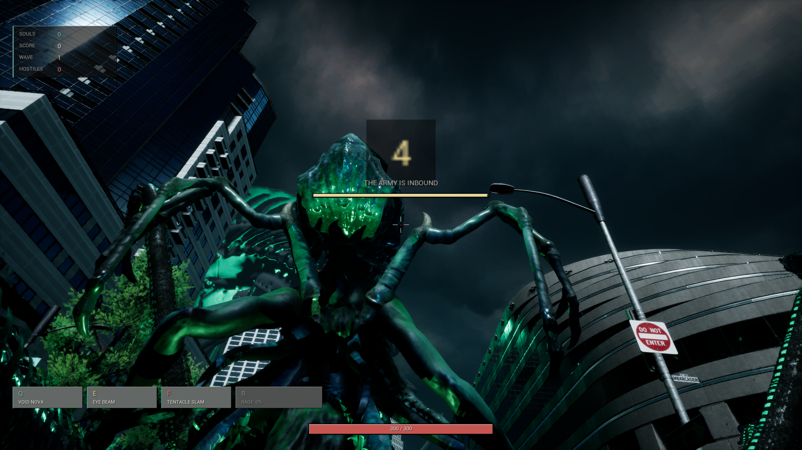
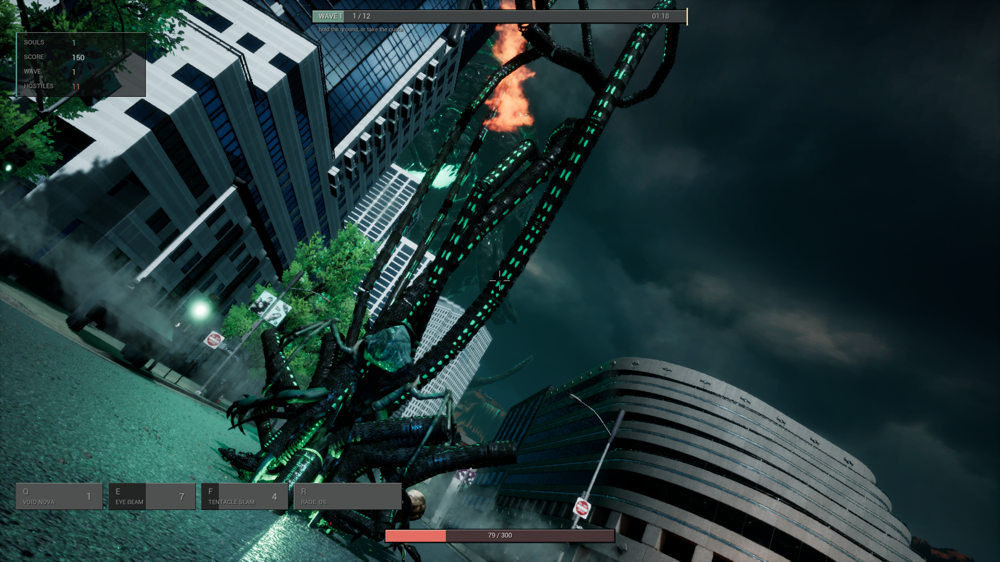
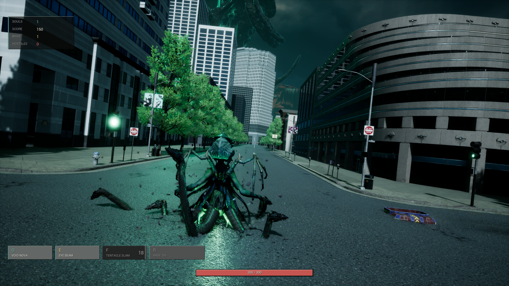
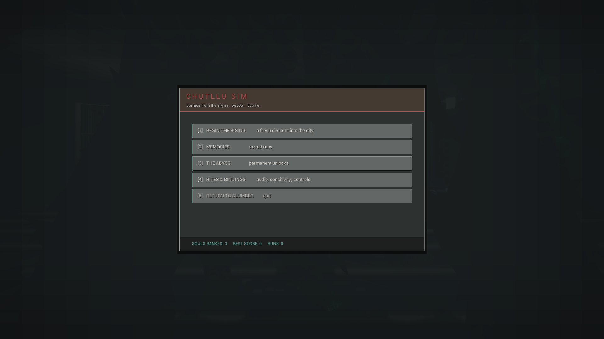
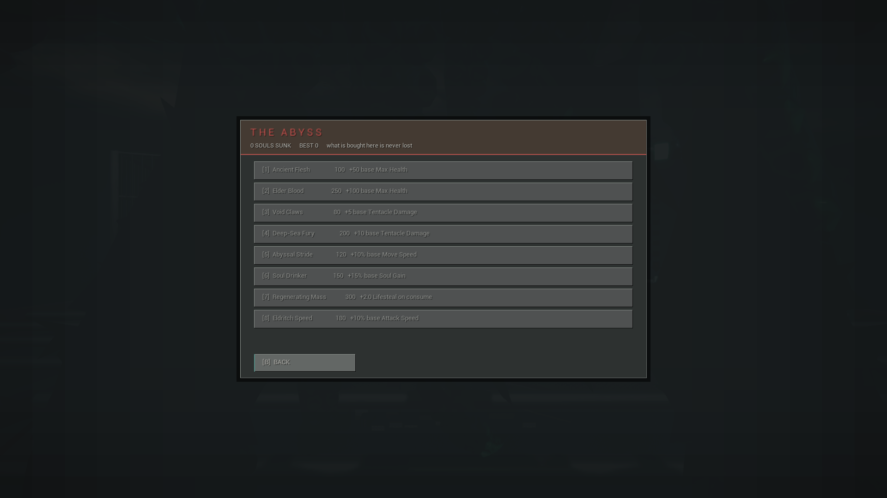
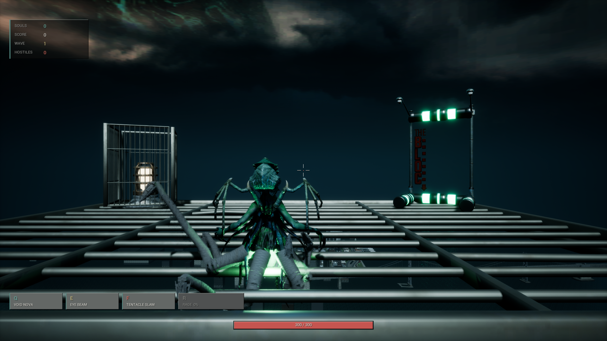
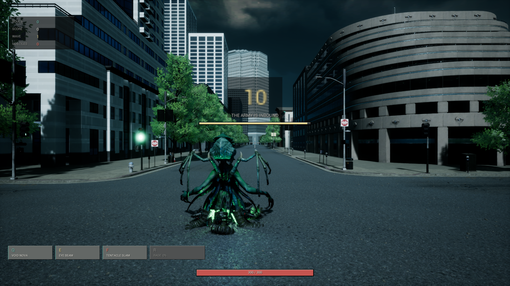

# Chutllu Sim — Eldritch Horror City Rampage & Roguelike Simulator

<p align="center">
  
</p>

<p align="center">
  
  
  
  
</p>

---

## Overview

> *"Surface from the abyss. Devour. Evolve."*

**Chutllu Sim** is a high-octane 3D action roguelike built in **Unreal Engine 5**. You awaken as an ancient eldritch leviathan rising beneath the skyscrapers of a modern metropolis. Using procedurally animated, physics-driven tentacles, your objective is simple: crush urban infrastructure, grab and devour fleeing populations, harvest their souls, and withstand the full retaliatory might of the military.

```
        ┌─────────────────────────────────────────────────────────────┐
        │  WAVE COMBAT                                                │
        │   - Escalating military threat (Infantry -> Tanks -> Jets)   │
        │   - Grab & devour civilians  -> +Souls & Health             │
        │   - Crush vehicles & bosses  -> +Massive Souls & Score      │
        └──────────────────────────────┬──────────────────────────────┘
                                       ▼
        ┌─────────────────────────────────────────────────────────────┐
        │  WAVE INTERMISSION & MUTATIONS                              │
        │   - Roguelike Drafting: Choose 1 of 3 Eldritch Passives     │
        │   - Abyss Sanctum: Unlock permanent meta-progression traits │
        │   - Evolve reach, lifesteal, damage, and tentacle count     │
        └─────────────────────────────────────────────────────────────┘
```

---

## Gameplay Features and Systems

<p align="center">
  
  
</p>

### Procedural Tentacle Combat and Consumption
* **Physics & Inverse Kinematics:** Real-time tentacle reach, physics grabs, and dynamic surface attachment allowing you to whip, slam, and seize targets anywhere on screen.
* **Grab & Devour Mechanic:** Snatch infantry, fleeing civilians, and light vehicles. Pulling victims into your abyssal maw instantly consumes them for **Souls** and regenerates vital health.
* **Devastating Eldritch Powers:**
  * **[Q] Void Nova:** Discharges an expanding shockwave of eldritch energy that obliterates nearby infantry and projectiles.
  * **[E] Eye Beam:** High-intensity concentrated cosmic laser that tears through armored vehicles and aircraft.
  * **[F] Tentacle Slam:** Earth-shattering ground pound flattening barricades and heavy tanks.
  * **[R] Eldritch Rage:** Build adrenaline through slaughter to unleash temporary invulnerability and maximum reach.

---

<p align="center">
  
  
</p>

### Roguelike Drafting and The Abyss
* **In-Run Passive Drafts:** Between combat waves, draft from three randomly offered eldritch blessings affecting damage, tentacle reach, movement speed, and lifesteal.
* **The Abyss (Permanent Meta-Progression):** Bank souls across runs to purchase permanent ascension passives:
  * **Ancient Flesh:** Exponentially scales base Max Health.
  * **Elder Blood:** Endows passive regeneration.
  * **Void Claws & Deep-Sea Fury:** Enhances tentacle damage and structural penetration.
  * **Abyssal Stride & Eldritch Speed:** Increases traversal velocity and attack cadence.
  * **Soul Drinker:** Increases soul multipliers for faster in-run scaling.

---

<p align="center">
  
  
</p>

### The City Fights Back (Enemy Roster)
The military escalates its response in structured, intense combat waves:
* **Infantry & Special Forces:** Heavy gunners, snipers, flame troopers, and rocket squads.
* **Ground Armor:** Armored personnel carriers (APCs), Anti-Air tanks, and Main Battle Tanks firing heavy ballistic shells.
* **Air Superiority:** Attack helicopters strafing with chainguns and unguided rockets, accompanied by high-altitude supersonic fighter jets.

---

## Technical Architecture (C++)

Built strictly in native C++ for maximum tick performance and physics reliability:

| Component | Responsibility |
|---|---|
| **`AChutlluCharacter`** | Core leviathan pawn: procedural tentacle management, grab/consume state machines, health components, and ability execution. |
| **`UChutlluHealthComponent`** | Unified damage resolution component utilized across the player, destructible city props, and military enemies. |
| **`UChutlluWaveManagerComponent`** | Wave director on the GameMode: oversees spawn budgets, wave state transitions, ambient civilian dispersal, and escalation curves. |
| **`UChutlluUpgradeComponent`** | Aggregates active `UChutlluPassiveEffect` data assets into live combat multipliers. |
| **`AChutlluEnemyBase` & Variants** | High-performance C++ AI enemies driving custom skeletal meshes, Niagara particle trails, and weapon sockets with zero Blueprint bloat. |

---

## Controls

| Key | Action |
|---|---|
| **`WASD`** | Traverse the city streets |
| **`Mouse`** | Aim tentacle focus & target crosshair |
| **`Left Mouse Button`** | Tentacle strike / Grab & Pull |
| **`Q`** | Cast **Void Nova** |
| **`E`** | Fire **Eye Beam** |
| **`F`** | Execute **Tentacle Slam** |
| **`R`** | Trigger **Eldritch Rage** |
| **`Esc / P`** | Open **The Lull** (Pause & Run Stats) |

---

## Build and Installation

1. Clone repository:
   ```bash
   git clone https://github.com/kubrvk/cthulhusimulator.git
   ```
2. Open `ChutlluSim.uproject` with **Unreal Engine 5.5+**.
3. Generate Visual Studio project files and build `ChutlluSimEditor` in **Development Editor - Win64**.
4. Launch the editor and open `Content/Maps/` or test in the Sanctuary starter area.

---

## License and Credits

Developed by [Kubrick](https://github.com/kubrvk). All rights reserved.
